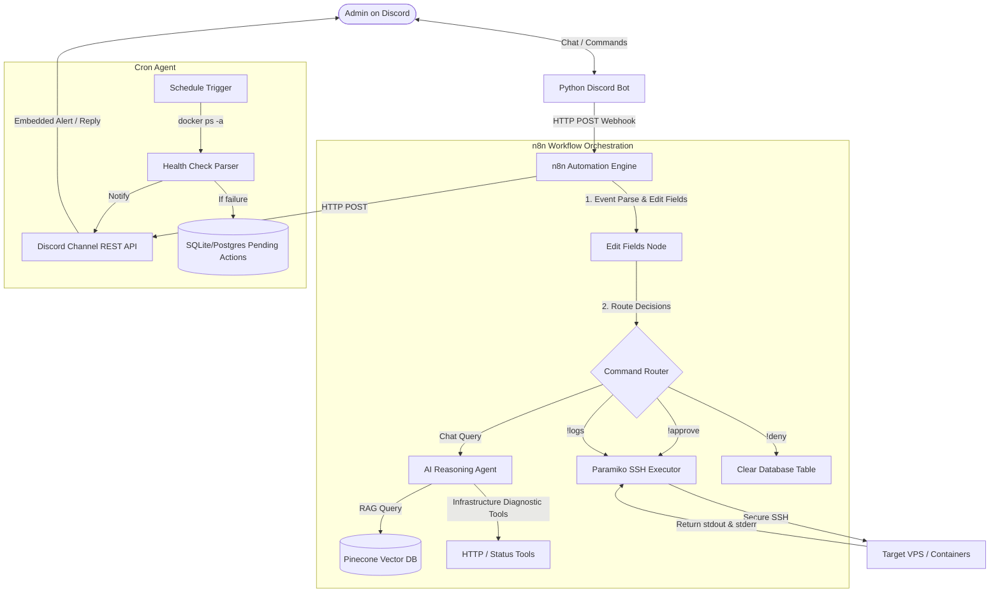

# AutOps — AI-Driven Incident Management & Infrastructure Automation

AutOps is an intelligent, lightweight, and deployable AIOps assistant designed for the **AMD Developer Hackathon on lablab.ai**. It empowers small operations and development teams to manage, diagnose, and remediate production infrastructure—including Docker containers and system processes—directly through a Discord chat interface.

By combining visual workflow orchestration in **n8n**, a **Retrieval-Augmented Generation (RAG)** pipeline backed by **Pinecone**, and LLM reasoning models via the **NVIDIA NIM** or **OpenRouter APIs**, AutOps turns complex infrastructure diagnostics and action loops into natural conversation.

---

## 🛠️ System Architecture

AutOps bridges the gap between server metrics, AI-driven diagnostics, and safe execution using a secure, event-driven pipeline. 



---

## 🚀 Key Features

*   **Natural Language Infrastructure Control**: Query container status, system metrics, and system logs through Discord.
*   **Human-in-the-Loop (HITL) Safety Gate**: No state-changing or destructive command is ever run automatically. The AI proposes remediation commands, which are staged in a database until approved or denied by an administrator.
*   **Automated Cron-based Health Checks**: Independent workflows query container statuses, parse failures, store pending remedies, and alert admins dynamically.
*   **Semantic RAG Contextualization**: Integrates a Pinecone vector database using `all-MiniLM-L6-v2` embeddings to provide the reasoning model with up-to-date documentation on container responsibilities and success thresholds.

---

## 🔬 Session Case Studies & Engineering Achievements

During our latest iteration, we tackled and resolved three major engineering challenges:

### 1. Hardening the Live Automation Pipeline (HITL)
> [!NOTE]
> **Problem:** State-changing commands approved by administrators were not reflected on the target servers, even though the bot reported success. Additionally, certain conversational branches crashed silently.
> 
> **Actions & Fixes:**
> *   Traced the data pipeline from Discord hooks to Paramiko SSH calls and identified that the target workflow was running an outdated, unpublished draft version.
> *   Fixed a nested parsing node that returned zero items for certain responses, which was killing the downstream n8n execution branch.
> *   Normalized the JSON payload referencing `$json.body.channel_id` across the fields editor, resolving undefined endpoints that triggered `HTTP 405 Method Not Allowed` errors.

### 2. Upgrading RAG and Knowledge Base Grounding
> [!TIP]
> **Problem:** The original knowledge base contained raw JSON mockups and static timestamp placeholders ("last checked"), leading to inaccurate embedding retrieval and hallucinated temporal states.
> 
> **Actions & Fixes:**
> *   Rewrote the system specifications into clean, semantic prose where each container is described in a distinct, self-contained record.
> *   Verified and updated all container health metrics (e.g., matching the actual website container HTML title `<title>AutOps</title>`).
> *   Removed misleading static timestamps, forcing the AI agent to rely on live, dynamic tool commands for any temporal data.

### 3. Evaluating Self-Hosted 49B Models on AMD GPUs
> [!IMPORTANT]
> **Problem:** We evaluated deploying a self-hosted **49-billion parameter reasoning model** running on local AMD GPU hardware via **vLLM** to reduce latency and API dependency.
> 
> **Actions & Findings:**
> *   Ran parallel evaluation suites between the self-hosted model and the smaller cloud model.
> *   The quantized 49B model proposed restarting a healthy container despite the log showing it was active, revealing instruction-following drift caused by precision degradation during 4-bit quantization.
> *   **Decision:** Prioritizing system safety over raw parameter size, we rolled back to the cloud model and documented quantization limits for agentic runtime tasks.

---

## 📁 Repository Directory Structure

The repository is structured logically to separate agent runtime environment configurations, server-side code, and system workflows:

*   [`/n8n/discord-bot/`](file:///c:/Users/naree/Downloads/AutOps-1/n8n/discord-bot): Python bot gateway that bridges Discord Gateway messages to stateless n8n Webhook calls.
*   [`/n8n/api/app/`](file:///c:/Users/naree/Downloads/AutOps-1/n8n/api/app): FastAPI service representing a production container application.
*   [`/n8n/monitor/`](file:///c:/Users/naree/Downloads/AutOps-1/n8n/monitor): Flask service representing a system process monitor.
*   [`/n8n/website/html/`](file:///c:/Users/naree/Downloads/AutOps-1/n8n/website/html): Static source files for the AutOps landing page.
*   [`/n8n/nginx/conf.d/`](file:///c:/Users/naree/Downloads/AutOps-1/n8n/nginx/conf.d): Nginx proxy layouts to route API traffic, website, and n8n dashboards securely.
*   [`/n8n/certbot/`](file:///c:/Users/naree/Downloads/AutOps-1/n8n/certbot): Let's Encrypt files and certificate generation configurations.
*   [`/n8n/n8n_data/`](file:///c:/Users/naree/Downloads/AutOps-1/n8n/n8n_data) & [`/n8n/n8n_data_backup/`](file:///c:/Users/naree/Downloads/AutOps-1/n8n/n8n_data_backup) *(Ignored by Git)*: Contains active SQLite databases and log outputs.

---

## ⌨️ Discord Interface Command Guide

The Discord Bot acts as the communication link. Beyond natural language chat queries, administrators can use three dedicated administrative prefixes:

| Command | Action | Example |
| :--- | :--- | :--- |
| `!approve <container>` | Executes the pending remediation action staged in the database for the container. | `!approve website` |
| `!deny <container>` | Dismisses the alert, clearing the pending status without executing commands. | `!deny website` |
| `!logs <container>` | Fetches and returns the last 20 lines of mixed stdout/stderr logs from the target container. | `!logs api` |

---

## 🚀 Installation & Local Setup

### 1. Prerequisites
Ensure you have Docker and Docker Compose installed on your system.

### 2. Environment Configuration
Create a `.env` file in the `n8n` directory:
```env
# Discord Token & Channel Details
TOKEN=your_discord_bot_token
CHANNEL_ID=YOUR_CHANNEL_ID

# API Webhooks and LLM Credentials
N8N_HOST=n8n.yourdomain.com
N8N_PROTOCOL=https
AUTOPS_N8N_WEBHOOK_SECRET=your_webhook_secret_key
N8N_NVIDIA_API_KEY=nvapi-your-key-here
PINECONE_API_KEY=your-pinecone-key
```

### 3. Running the Stack
Build and launch all services in detached mode:
```bash
cd n8n
docker compose up -d --build
```

### 4. Logging & Verification
You can monitor the Discord gateway container's status at any time:
```bash
docker compose logs -f discord-bot
```

---
